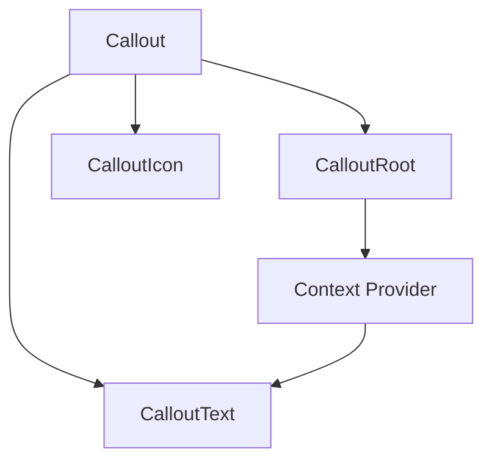

# Callout Component Implementation Plan

## Overview

This document outlines the implementation plan for the Callout component in `radix-ui-themes-native`, following the patterns established by the Radix UI web version while adapting to React Native conventions.

## Component Structure

The Callout component is a compound component consisting of:



### API Design

```tsx
// Usage example
<Callout.Root variant="soft" size={2} color="red">
  <Callout.Icon>
    <InfoIcon />
  </Callout.Icon>
  <Callout.Text>
    This is an important message
  </Callout.Text>
</Callout.Root>
```

## Props Specification

### CalloutRoot Props

| Prop | Type | Default | Description |
|------|------|---------|-------------|
| `size` | `1 \| 2 \| 3` | `2` | Size variant affecting padding and text size |
| `variant` | `'soft' \| 'surface' \| 'outline'` | `'soft'` | Visual style variant |
| `color` | `Color` | theme.accentColor | Color scheme |
| `highContrast` | `boolean` | `false` | High contrast mode for accessibility |
| `asChild` | `boolean` | `false` | Merge props onto child element |
| `children` | `ReactNode` | - | Child components |

### CalloutIcon Props

| Prop | Type | Default | Description |
|------|------|---------|-------------|
| `children` | `ReactNode` | - | Icon element |
| `style` | `StyleProp<ViewStyle>` | - | Custom styles |

### CalloutText Props

| Prop | Type | Default | Description |
|------|------|---------|-------------|
| `children` | `ReactNode` | - | Text content |
| `style` | `StyleProp<TextStyle>` | - | Custom styles |
| `trim` | `'start' \| 'end' \| 'both'` | - | Trim whitespace |

## Size Mapping

Callout sizes map to Text sizes as follows:

| Callout Size | Text Size | Padding | Gap | Border Radius |
|--------------|-----------|---------|-----|---------------|
| 1 | 2 | space[3] | space[2] | radii[3] |
| 2 | 2 | space[4] | space[3] | radii[4] |
| 3 | 3 | space[5] | space[4] | radii[5] |

## Variant Styles

### Soft Variant (default)
- Background: `colorAlpha[3]`
- Border: none
- Text: `colorAlpha[11]`

### Surface Variant
- Background: `colorAlpha[2]`
- Border: `colorAlpha[6]` (1px inset)
- Text: `colorAlpha[11]`

### Outline Variant
- Background: transparent
- Border: `colorAlpha[7]` (1px inset)
- Text: `colorAlpha[11]`

### High Contrast Mode
- Text: `color[12]` instead of `colorAlpha[11]`

## Implementation Details

### File Structure

```
packages/radix-ui-themes-native/src/components/data-display/
├── Callout.tsx      # New file
├── index.ts         # Update exports
```

### Context Pattern

```tsx
type CalloutContextValue = {
  size?: 1 | 2 | 3;
  color?: Color;
  highContrast?: boolean;
};

const CalloutContext = React.createContext<CalloutContextValue>({});
```

### Layout Strategy

Since React Native does not support CSS Grid, we will use Flexbox:

```tsx
// CalloutRoot layout
<View style={{
  flexDirection: 'row',
  alignItems: 'flex-start',
  gap: columnGap, // based on size
  padding: padding, // based on size
  borderRadius: borderRadius, // based on size
  backgroundColor: variantColors.backgroundColor,
  borderWidth: variantColors.borderWidth,
  borderColor: variantColors.borderColor,
}}>
  {children}
</View>
```

### Color Handling

Use existing helper functions from [`color-helpers.ts`](packages/radix-ui-themes-native/src/theme/color-helpers.ts):

```tsx
const variantColors = getVariantColors(theme, activeColor, mode, variant, highContrast);
```

## Implementation Steps

1. **Create Callout.tsx** with the compound component pattern
   - Define context for sharing size/color between components
   - Implement CalloutRoot with variant and size support
   - Implement CalloutIcon as a simple wrapper
   - Implement CalloutText using the existing Text component

2. **Update exports** in [`data-display/index.ts`](packages/radix-ui-themes-native/src/components/data-display/index.ts)

3. **Create demo page** in `apps/playground-native/app/demo/callout/`

4. **Test all variants and sizes**

## Code Template

```tsx
import React, { createContext, useContext, forwardRef, ReactNode } from 'react';
import { StyleSheet, type StyleProp, type ViewStyle, type TextStyle, View } from 'react-native';
import { Slot } from '../utilities/Slot';
import { Text } from '../typography';
import { useTheme, useThemeMode } from '../../hooks/useTheme';
import { getVariantColors, getColorAlpha } from '../../theme/color-helpers';
import type { Color, RadiusSize } from '../../theme';

// Context
type CalloutContextValue = {
  size: 1 | 2 | 3;
  color?: Color;
  highContrast: boolean;
};

const CalloutContext = createContext<CalloutContextValue>({
  size: 2,
  highContrast: false,
});

// Root Component
interface CalloutRootProps {
  children: ReactNode;
  size?: 1 | 2 | 3;
  variant?: 'soft' | 'surface' | 'outline';
  color?: Color;
  highContrast?: boolean;
  asChild?: boolean;
  style?: StyleProp<ViewStyle>;
}

const CalloutRoot = forwardRef<View, CalloutRootProps>(
  ({ children, size = 2, variant = 'soft', color, highContrast = false, asChild, style, ...rest }, ref) => {
    const theme = useTheme();
    const mode = useThemeMode();
    const activeColor = color || theme.accentColor;
    
    // Get variant colors
    const variantColors = getVariantColors(theme, activeColor, mode, variant, highContrast);
    const colorAlpha = getColorAlpha(theme, activeColor);
    
    // Size-based styles
    const sizeStyles = getSizeStyles(size, theme);
    
    // ... implementation
  }
);

// Icon Component
interface CalloutIconProps {
  children: ReactNode;
  style?: StyleProp<ViewStyle>;
}

const CalloutIcon = forwardRef<View, CalloutIconProps>(
  ({ children, style }, ref) => {
    const { size } = useContext(CalloutContext);
    // ... implementation
  }
);

// Text Component
interface CalloutTextProps {
  children: ReactNode;
  style?: StyleProp<TextStyle>;
}

const CalloutText = forwardRef<Text, CalloutTextProps>(
  ({ children, style }, ref) => {
    const { size, color, highContrast } = useContext(CalloutContext);
    const textSize = mapCalloutSizeToTextSize(size);
    // ... implementation
  }
);

// Compound export
export const Callout = {
  Root: CalloutRoot,
  Icon: CalloutIcon,
  Text: CalloutText,
};
```

## Demo Page Structure

The demo page should showcase:

1. All variants (soft, surface, outline)
2. All sizes (1, 2, 3)
3. With and without icons
4. Different colors
5. High contrast mode
6. Multiple Callout.Text elements

## Testing Checklist

- [ ] Renders correctly on iOS
- [ ] Renders correctly on Android
- [ ] All variants display properly
- [ ] All sizes display properly
- [ ] Color prop works with all theme colors
- [ ] High contrast mode works
- [ ] Icon positioning is correct
- [ ] Text sizing follows size prop
- [ ] Dark mode support
