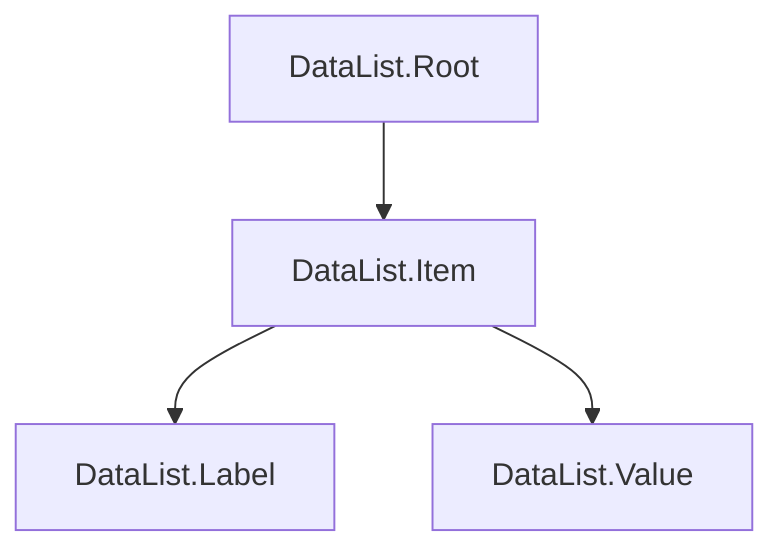

# DataList Component Implementation Plan

## Overview

This document outlines the implementation plan for the DataList component in `radix-ui-themes-native`. The DataList component is a key-value list component for displaying data in a structured format, matching the API and behavior of the radix-ui web DataList component.

## Reference Implementation

The radix-ui web DataList component is located at:
- Component: [`packages/radix-ui-themes/src/components/data-list.tsx`](../packages/radix-ui-themes/src/components/data-list.tsx)
- Styles: [`packages/radix-ui-themes/src/components/data-list.css`](../packages/radix-ui-themes/src/components/data-list.css)

## Component Architecture

### Compound Component Pattern

The DataList follows a compound component pattern similar to AlertDialog in the native project:



### Components

| Component | Web Element | Native Equivalent | Description |
|-----------|-------------|-------------------|-------------|
| `DataList.Root` | `<dl>` | `View` | Container for the data list |
| `DataList.Item` | `<div>` | `View` | Individual key-value pair row |
| `DataList.Label` | `<dt>` | `Text` | Label/key portion |
| `DataList.Value` | `<dd>` | `Text` or `View` | Value portion |

## Props API

### DataList.Root Props

| Prop | Type | Default | Description |
|------|------|---------|-------------|
| `orientation` | `horizontal` \| `vertical` | `horizontal` | Layout direction |
| `size` | `1` \| `2` \| `3` | `2` | Spacing size |
| `trim` | `normal` \| `start` \| `end` \| `both` | `normal` | Leading trim behavior |
| `style` | `StyleProp<ViewStyle>` | - | Custom styles |

### DataList.Item Props

| Prop | Type | Default | Description |
|------|------|---------|-------------|
| `align` | `baseline` \| `start` \| `center` \| `end` \| `stretch` | `baseline` | Vertical alignment |
| `style` | `StyleProp<ViewStyle>` | - | Custom styles |

### DataList.Label Props

| Prop | Type | Default | Description |
|------|------|---------|-------------|
| `color` | `Color` | - | Accent color |
| `highContrast` | `boolean` | `false` | Use high contrast color |
| `width` | `number` \| `string` | - | Fixed width for label |
| `style` | `StyleProp<TextStyle>` | - | Custom styles |

### DataList.Value Props

| Prop | Type | Default | Description |
|------|------|---------|-------------|
| `style` | `StyleProp<ViewStyle>` | - | Custom styles |

## Implementation Details

### Context Structure

```typescript
interface DataListContextValue {
  orientation: 'horizontal' | 'vertical';
  size: 1 | 2 | 3;
  trim: 'normal' | 'start' | 'end' | 'both';
}
```

### Size Configuration

| Size | Gap | Label Min Width |
|------|-----|-----------------|
| 1 | `space[3]` | 100px |
| 2 | `space[4]` | 120px |
| 3 | `space[4] * 1.25` | 140px |

### Orientation Layouts

#### Horizontal Layout - Default

```
┌─────────────────────────────────────────────┐
│ Label    │ Value                            │
├─────────────────────────────────────────────┤
│ Label    │ Value                            │
├─────────────────────────────────────────────┤
│ Label    │ Value                            │
└─────────────────────────────────────────────┘
```

- Uses Flexbox with `flexDirection: 'row'`
- Label has minimum width
- Value takes remaining space

#### Vertical Layout

```
┌─────────────────────────────────────────────┐
│ Label                                       │
│ Value                                       │
├─────────────────────────────────────────────┤
│ Label                                       │
│ Value                                       │
└─────────────────────────────────────────────┘
```

- Uses Flexbox with `flexDirection: 'column'`
- Label and Value are stacked

### Color Handling

The Label component supports accent colors:

```typescript
// Default: gray color
color: theme.colors.gray[11] // or gray.dark[11] in dark mode

// With accent color
color: theme.colors[color][11] // e.g., theme.colors.blue[11]

// High contrast
color: theme.colors[gray or accent][12]
```

### Alignment Implementation

| Align | Implementation |
|-------|----------------|
| `baseline` | `alignItems: 'baseline'` (horizontal) / `flex-start` (vertical) |
| `start` | `alignItems: 'flex-start'` |
| `center` | `alignItems: 'center'` |
| `end` | `alignItems: 'flex-end'` |
| `stretch` | `alignItems: 'stretch'` |

## File Structure

```
packages/radix-ui-themes-native/src/components/data-display/
├── index.ts              # Update exports
├── DataList.tsx          # New DataList component
└── FancyList.tsx         # Keep existing (different use case)
```

## Implementation Steps

### Step 1: Create DataList.tsx

Create the main component file with:
- DataListContext for sharing props
- DataListRoot component
- DataListItem component
- DataListLabel component
- DataListValue component
- Compound export object

### Step 2: Update Exports

Update [`data-display/index.ts`](../packages/radix-ui-themes-native/src/components/data-display/index.ts) to export DataList components.

### Step 3: Create Demo Page

Create a demo page at [`apps/playground-native/app/demo/datalist/index.tsx`](../apps/playground-native/app/demo/datalist/index.tsx) showcasing:
- Basic usage
- Orientation variants
- Size variants
- Alignment options
- Color options
- Real-world examples

### Step 4: Update Demo Index

Add DataList to the demo index page.

## Code Example

### Basic Usage

```tsx
import { DataList } from '@radix-ui/themes-native';

<DataList.Root>
  <DataList.Item>
    <DataList.Label>Name</DataList.Label>
    <DataList.Value>John Doe</DataList.Value>
  </DataList.Item>
  <DataList.Item>
    <DataList.Label>Email</DataList.Label>
    <DataList.Value>john@example.com</DataList.Value>
  </DataList.Item>
</DataList.Root>
```

### With Options

```tsx
<DataList.Root orientation="vertical" size="2">
  <DataList.Item align="center">
    <DataList.Label color="blue" highContrast>
      Status
    </DataList.Label>
    <DataList.Value>
      <Badge color="green">Active</Badge>
    </DataList.Value>
  </DataList.Item>
</DataList.Root>
```

## Differences from Web Version

| Feature | Web | Native | Notes |
|---------|-----|--------|-------|
| CSS Grid | Yes | No | Native uses Flexbox |
| Subgrid | Yes | No | Not supported in React Native |
| CSS Variables | Yes | No | Use theme hooks instead |
| Leading Trim | CSS | Approximate | Use margin adjustments |

## Testing Considerations

- Test all orientation and size combinations
- Test alignment options
- Test color prop with all accent colors
- Test highContrast prop
- Test in both light and dark modes
- Test with long text content
- Test with complex children (Badges, Buttons, etc.)

## Notes

- The existing `FancyList` component serves a different purpose (rendering arrays of data with FlatList) and should be kept
- DataList is for static key-value pairs, while FancyList is for dynamic lists
- Consider adding a convenience component that accepts a data array for simpler use cases
