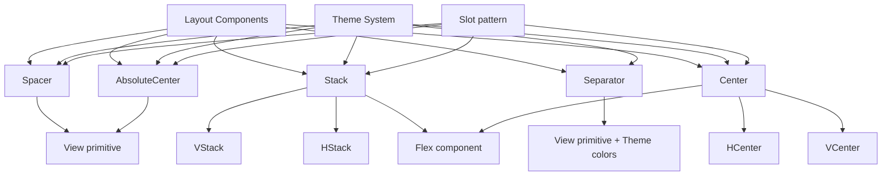

# Layout Components Implementation Plan

## Overview

This plan outlines the implementation of Layout components for the `radix-ui-themes-native` library:

1. **Spacer** - Utility component for adding flexible or fixed space
2. **Stack** - Simplified flex container for stacking elements (with VStack, HStack variants)
3. **Separator** - Visual divider between sections
4. **Center** - Utility component for centering content (with HCenter, VCenter, AbsoluteCenter variants)

---

## Component Specifications

### 1. Spacer Component

**Purpose:** A utility component that creates space between elements in flex containers.

**API Design:**

```tsx
type SpacerDirection = 'horizontal' | 'vertical' | 'both';

interface SpacerProps {
  /**
   * Flex grow value - determines how the spacer grows
   * @default 1
   */
  flex?: number;
  
  /**
   * Size of the spacer using theme.space scale (1-9)
   * When provided, uses fixed size instead of flexible
   */
  size?: 1 | 2 | 3 | 4 | 5 | 6 | 7 | 8 | 9;
  
  /**
   * Direction of the spacer
   * - 'horizontal': takes horizontal space (width)
   * - 'vertical': takes vertical space (height)
   * - 'both': takes space in both directions
   * @default 'both'
   */
  direction?: SpacerDirection;
  
  /**
   * Custom style
   */
  style?: StyleProp<ViewStyle>;
}
```

**Usage Examples:**

```tsx
// Flexible spacer - pushes items apart
<Flex direction="row">
  <Text>Left</Text>
  <Spacer />
  <Text>Right</Text>
</Flex>

// Fixed size spacer using theme.space
<Flex direction="row">
  <Text>Item 1</Text>
  <Spacer size={4} />
  <Text>Item 2</Text>
</Flex>

// Direction-specific spacer
<Flex direction="column">
  <Text>Top</Text>
  <Spacer direction="vertical" size={3} />
  <Text>Bottom</Text>
</Flex>
```

**Implementation Notes:**
- When `size` is provided, uses fixed dimensions from `theme.space`
- When only `flex` is provided, creates flexible space
- Direction controls which dimension(s) are affected

---

### 2. Stack Component

**Purpose:** A simplified flex container optimized for stacking elements with consistent gaps.

**API Design:**

```tsx
type StackDirection = 'horizontal' | 'vertical';

interface StackProps {
  /**
   * Children components
   */
  children?: React.ReactNode;
  
  /**
   * Stack direction
   * - 'horizontal': stack items in a row
   * - 'vertical': stack items in a column
   * @default 'vertical'
   */
  direction?: StackDirection;
  
  /**
   * Gap between items using theme.space scale (1-9)
   */
  gap?: 1 | 2 | 3 | 4 | 5 | 6 | 7 | 8 | 9;
  
  /**
   * Align items on cross axis
   */
  align?: 'flex-start' | 'center' | 'flex-end' | 'stretch' | 'baseline';
  
  /**
   * Justify content on main axis
   */
  justify?: 'flex-start' | 'center' | 'flex-end' | 'space-between' | 'space-around' | 'space-evenly';
  
  /**
   * Wrap items
   * @default 'nowrap'
   */
  wrap?: 'wrap' | 'nowrap' | 'wrap-reverse';
  
  /**
   * Whether to merge props onto immediate child
   */
  asChild?: boolean;
  
  /**
   * Custom style
   */
  style?: StyleProp<ViewStyle>;
  
  /**
   * Width
   */
  width?: DimensionValue;
  
  /**
   * Height
   */
  height?: DimensionValue;
}

// Convenience wrappers
interface VStackProps extends Omit<StackProps, 'direction'> {}
interface HStackProps extends Omit<StackProps, 'direction'> {}
```

**Usage Examples:**

```tsx
// Vertical stack (default)
<Stack gap={3}>
  <Text>Item 1</Text>
  <Text>Item 2</Text>
  <Text>Item 3</Text>
</Stack>

// Horizontal stack
<Stack direction="horizontal" gap={2}>
  <Button>Cancel</Button>
  <Button>Confirm</Button>
</Stack>

// Using convenience wrappers
<VStack gap={4}>
  <Text>Vertical item 1</Text>
  <Text>Vertical item 2</Text>
</VStack>

<HStack gap={2} align="center">
  <Text>Horizontal item 1</Text>
  <Text>Horizontal item 2</Text>
</HStack>

// With wrap
<HStack gap={2} wrap="wrap">
  <Badge>Tag 1</Badge>
  <Badge>Tag 2</Badge>
  <Badge>Tag 3</Badge>
</HStack>
```

**Implementation Notes:**
- `direction="vertical"` maps to `flexDirection: 'column'`
- `direction="horizontal"` maps to `flexDirection: 'row'`
- Gap uses `theme.space` values
- VStack is Stack with `direction="vertical"` pre-set
- HStack is Stack with `direction="horizontal"` pre-set

---

### 3. Separator Component

**Purpose:** A visual divider between sections or groups of content.

**API Design:**

```tsx
type SeparatorOrientation = 'horizontal' | 'vertical';

interface SeparatorProps {
  /**
   * Orientation of the separator
   * @default 'horizontal'
   */
  orientation?: SeparatorOrientation;
  
  /**
   * Size/thickness of the separator
   * @default 1
   */
  size?: number;
  
  /**
   * Color using theme color system
   * @default 'gray'
   */
  color?: Color;
  
  /**
   * Whether to use decorative styling (no semantic meaning)
   * @default true
   */
  decorative?: boolean;
  
  /**
   * Custom style
   */
  style?: StyleProp<ViewStyle>;
  
  /**
   * Margin on the sides (uses theme.space)
   */
  margin?: 1 | 2 | 3 | 4 | 5 | 6 | 7 | 8 | 9;
  
  /**
   * Margin vertical (for horizontal separators)
   */
  marginVertical?: 1 | 2 | 3 | 4 | 5 | 6 | 7 | 8 | 9;
  
  /**
   * Margin horizontal (for vertical separators)
   */
  marginHorizontal?: 1 | 2 | 3 | 4 | 5 | 6 | 7 | 8 | 9;
}
```

**Usage Examples:**

```tsx
// Horizontal separator
<Text>Section 1</Text>
<Separator />
<Text>Section 2</Text>

// Vertical separator
<HStack align="center">
  <Text>Left</Text>
  <Separator orientation="vertical" style={{ height: 20 }} />
  <Text>Right</Text>
</HStack>

// With custom color
<Separator color="blue" />

// With margin
<Separator marginVertical={4} />

// Custom thickness
<Separator size={2} />
```

**Implementation Notes:**
- Uses theme colors based on the `Color` type
- Horizontal: full width, 1px height (default)
- Vertical: full height (or specified), 1px width (default)
- Supports accessibility (decorative vs semantic)

---

### 4. Center Component

**Purpose:** A utility component for centering content horizontally, vertically, or both.

**API Design:**

```tsx
type CenterAxis = 'horizontal' | 'vertical' | 'both';

interface CenterProps {
  /**
   * Children components
   */
  children?: React.ReactNode;
  
  /**
   * Axis to center on
   * - 'horizontal': center horizontally only
   * - 'vertical': center vertically only
   * - 'both': center on both axes (default)
   * @default 'both'
   */
  axis?: CenterAxis;
  
  /**
   * Whether to merge props onto immediate child
   */
  asChild?: boolean;
  
  /**
   * Custom style
   */
  style?: StyleProp<ViewStyle>;
  
  /**
   * Width of the center container
   */
  width?: DimensionValue;
  
  /**
   * Height of the center container
   */
  height?: DimensionValue;
  
  /**
   * Background color
   */
  backgroundColor?: string;
  
  /**
   * Border radius
   */
  radius?: RadiusSize;
}

// Convenience wrappers
interface HCenterProps extends Omit<CenterProps, 'axis'> {}
interface VCenterProps extends Omit<CenterProps, 'axis'> {}
```

**Usage Examples:**

```tsx
// Center both axes (default)
<Center style={{ height: 200 }}>
  <Text>Centered content</Text>
</Center>

// Center horizontally only
<Center axis="horizontal">
  <Text>Horizontally centered</Text>
</Center>

// Center vertically only
<Center axis="vertical" style={{ height: 200 }}>
  <Text>Vertically centered</Text>
</Center>

// Using convenience wrappers
<HCenter>
  <Text>Horizontally centered</Text>
</HCenter>

<VCenter style={{ height: 200 }}>
  <Text>Vertically centered</Text>
</VCenter>

// Full screen center
<Center width="100%" height="100%">
  <Spinner />
</Center>

// Center with background
<Center backgroundColor="gray.3" radius="large" width={100} height={100}>
  <Icon name="check" />
</Center>
```

**Implementation Notes:**
- `axis="both"`: `justifyContent: 'center'` + `alignItems: 'center'`
- `axis="horizontal"`: `alignItems: 'center'` only
- `axis="vertical"`: `justifyContent: 'center'` only
- HCenter is Center with `axis="horizontal"` pre-set
- VCenter is Center with `axis="vertical"` pre-set

---

### 5. AbsoluteCenter Component

**Purpose:** A component for centering content using absolute positioning.

**API Design:**

```tsx
interface AbsoluteCenterProps {
  /**
   * Children components
   */
  children?: React.ReactNode;
  
  /**
   * Whether to merge props onto immediate child
   */
  asChild?: boolean;
  
  /**
   * Custom style
   */
  style?: StyleProp<ViewStyle>;
  
  /**
   * Width of the center container
   */
  width?: DimensionValue;
  
  /**
   * Height of the center container
   */
  height?: DimensionValue;
}
```

**Usage Examples:**

```tsx
// Absolute center within a positioned parent
<Box style={{ position: 'relative', width: 200, height: 200 }}>
  <AbsoluteCenter>
    <Spinner />
  </AbsoluteCenter>
</Box>

// Overlay center
<Box style={{ position: 'absolute', inset: 0 }}>
  <AbsoluteCenter>
    <Text>Loading...</Text>
  </AbsoluteCenter>
</Box>
```

**Implementation Notes:**
- Uses `position: 'absolute'` with `top: 50%`, `left: 50%`, and transform for centering
- Parent must have `position: 'relative'` (or absolute/fixed)
- Useful for overlays, loading states, and positioned elements

---

## Implementation Architecture



---

## File Changes Required

### New Files to Create

| File Path | Description |
|-----------|-------------|
| `packages/radix-ui-themes-native/src/components/layout/Spacer.tsx` | Spacer component |
| `packages/radix-ui-themes-native/src/components/layout/Stack.tsx` | Stack, VStack, HStack components |
| `packages/radix-ui-themes-native/src/components/layout/Separator.tsx` | Separator component |
| `packages/radix-ui-themes-native/src/components/layout/Center.tsx` | Center, HCenter, VCenter, AbsoluteCenter components |
| `apps/playground-native/app/demo/spacer/index.tsx` | Spacer demo page |
| `apps/playground-native/app/demo/stack/index.tsx` | Stack demo page |
| `apps/playground-native/app/demo/separator/index.tsx` | Separator demo page |
| `apps/playground-native/app/demo/center/index.tsx` | Center demo page |
| `docs/components/layout/spacer.mdx` | Spacer documentation |
| `docs/components/layout/stack.mdx` | Stack documentation |
| `docs/components/layout/separator.mdx` | Separator documentation |
| `docs/components/layout/center.mdx` | Center documentation |

### Files to Modify

| File Path | Changes |
|-----------|---------|
| `packages/radix-ui-themes-native/src/components/layout/index.ts` | Add exports for new components |
| `apps/playground-native/app/demo/index.tsx` | Add navigation entries for new demos |

---

## Implementation Order

1. **Spacer** - Simplest component, establishes patterns
2. **Separator** - Similar to existing Separator patterns in DropdownMenu
3. **Stack** (with VStack, HStack) - Builds on Flex, adds convenience layer
4. **Center** (with HCenter, VCenter) - Simple flex wrapper
5. **AbsoluteCenter** - Uses absolute positioning

---

## Theme Integration

All components integrate with the existing theme system:

```tsx
// From types.ts
type Color = 'gray' | 'blue' | 'red' | 'green' | ... // 25+ colors

interface SpaceScale {
  1: number;  // ~4px
  2: number;  // ~8px
  3: number;  // ~12px
  4: number;  // ~16px
  5: number;  // ~24px
  6: number;  // ~32px
  7: number;  // ~40px
  8: number;  // ~48px
  9: number;  // ~64px
}
```

---

## Testing Considerations

Each component should have demo pages that showcase:

1. **Spacer**
   - Flexible vs fixed size
   - Direction variations
   - In context with other components

2. **Stack (VStack, HStack)**
   - Vertical and horizontal stacking
   - Gap variations using theme.space
   - Alignment options
   - Wrap behavior
   - Nested stacks

3. **Separator**
   - Horizontal and vertical orientations
   - Color variations using Color type
   - Custom sizes and margins
   - Dark mode appearance

4. **Center (HCenter, VCenter, AbsoluteCenter)**
   - Axis variations
   - Full screen centering
   - With background and radius
   - Absolute centering in positioned containers

---

## References

- [Radix UI Themes - Layout Components](https://www.radix-ui.com/themes/docs/components/box)
- [Chakra UI - Layout Components](https://chakra-ui.com/docs/components/stack)
- Existing implementations in this codebase:
  - [`Box.tsx`](packages/radix-ui-themes-native/src/components/layout/Box.tsx)
  - [`Flex.tsx`](packages/radix-ui-themes-native/src/components/layout/Flex.tsx)
  - [`types.ts`](packages/radix-ui-themes-native/src/theme/types.ts)
