# Progress Component Improvement Plan

## Overview

The [`Progress.tsx`](../packages/radix-ui-themes-native/src/components/data-display/Progress.tsx) component is a simple progress bar implementation that needs several improvements to align with other components in the codebase like [`Slider.tsx`](../packages/radix-ui-themes-native/src/components/forms/Slider.tsx) and [`Spinner.tsx`](../packages/radix-ui-themes-native/src/components/data-display/Spinner.tsx).

## Current Issues

### 1. Unused `Animated` Import
- **Location**: Line 2, 98
- **Issue**: The component imports `Animated` and uses `Animated.View`, but there's no actual animation. The width is set directly as a static percentage.
- **Impact**: Misleading code, unused animation capabilities

### 2. Missing `ref` Forwarding
- **Issue**: Unlike Slider and Spinner which use `React.forwardRef`, Progress doesn't forward refs
- **Impact**: Inconsistent API, prevents imperative access to the component

### 3. Missing `testID` Prop
- **Issue**: No `testID` prop for testing
- **Impact**: Harder to test in automated test suites

### 4. Missing `highContrast` Prop
- **Issue**: No `highContrast` prop for accessibility
- **Impact**: Poor accessibility support for users who need higher contrast

### 5. Color Prop Not Using Theme Type
- **Issue**: `color` prop is typed as `string` instead of `Color` type from theme
- **Impact**: No type safety for theme colors, inconsistent with other components

### 6. Missing `radius` Prop
- **Issue**: Border radius is hardcoded based on size
- **Impact**: Less customization flexibility

### 7. No Animation on Value Change
- **Issue**: Progress indicator doesn't animate when value changes
- **Impact**: Jarring UX, feels less polished

### 8. Missing Demo Page
- **Issue**: No demo page in playground app
- **Impact**: Harder to develop and test the component

### 9. Missing `variant` Prop
- **Issue**: No variant support like other components have
- **Impact**: Limited visual customization

---

## Proposed Improvements

### Phase 1: Core Component Updates

#### 1.1 Add `ref` Forwarding

```tsx
import React, { forwardRef, useRef, useEffect } from 'react';
import { View as RNView } from 'react-native';

const Progress = forwardRef<React.ComponentRef<typeof RNView>, ProgressProps>(
  (props, ref) => {
    // Component implementation
  }
);
```

#### 1.2 Add Proper Animation Support

Use `useAnimatedValue` hook or `useRef` with `Animated.Value` for smooth transitions:

```tsx
// Inside component
const animatedWidth = useRef(new Animated.Value(0)).current;

useEffect(() => {
  Animated.timing(animatedWidth, {
    toValue: progress,
    duration: 300,
    useNativeDriver: false, // width cannot use native driver
  }).start();
}, [progress]);

// In render
<Animated.View
  style={[
    styles.indicator,
    {
      width: animatedWidth.interpolate({
        inputRange: [0, 1],
        outputRange: ['0%', '100%'],
      }),
      backgroundColor: indicatorColor,
    },
  ]}
/>
```

#### 1.3 Update Props Interface

```tsx
import { Color, RadiusSize } from '../../theme';

interface ProgressProps {
  /** Current value of the progress */
  value: number;
  /** Maximum value @default 100 */
  max?: number;
  /** Progress bar size @default 2 */
  size?: 1 | 2 | 3;
  /** Visual style variant @default 'surface' */
  variant?: 'surface' | 'solid' | 'soft';
  /** Custom color for the progress indicator */
  color?: Color;
  /** Radius variant */
  radius?: RadiusSize;
  /** High contrast mode for accessibility */
  highContrast?: boolean;
  /** Custom style */
  style?: StyleProp<ViewStyle>;
  /** Accessibility label */
  accessibilityLabel?: string;
  /** Test ID for testing */
  testID?: string;
}
```

#### 1.4 Add Variant Support

```tsx
const getIndicatorColor = () => {
  if (color) {
    const colorScale = getColorScale(theme, color, mode);
    return highContrast ? colorScale[12] : colorScale[9];
  }
  return highContrast ? accentScale[12] : accentScale[9];
};

const getTrackColor = () => {
  switch (variant) {
    case 'solid':
      return isDark ? grayAlpha['7'] : grayAlpha['6'];
    case 'soft':
      return color ? colorAlpha['3'] : accentAlpha['3'];
    case 'surface':
    default:
      return isDark ? grayAlpha['7'] : grayAlpha['6'];
  }
};
```

### Phase 2: Demo Page Creation

Create `apps/playground-native/app/demo/progress/index.tsx`:

```tsx
import React, { useState, useEffect } from 'react';
import { View, ScrollView } from 'react-native';
import { Progress, Text, Button } from 'radix-ui-themes-native';

export default function ProgressDemo() {
  const [value, setValue] = useState(0);

  // Auto-increment demo
  useEffect(() => {
    const interval = setInterval(() => {
      setValue(v => v >= 100 ? 0 : v + 10);
    }, 1000);
    return () => clearInterval(interval);
  }, []);

  return (
    <ScrollView>
      {/* Basic Progress */}
      <Text>Basic Progress</Text>
      <Progress value={50} />

      {/* Sizes */}
      <Text>Size 1</Text>
      <Progress value={60} size={1} />
      <Text>Size 2</Text>
      <Progress value={60} size={2} />
      <Text>Size 3</Text>
      <Progress value={60} size={3} />

      {/* Colors */}
      <Text>Custom Colors</Text>
      <Progress value={70} color="blue" />
      <Progress value={70} color="green" />
      <Progress value={70} color="red" />

      {/* Variants */}
      <Text>Variants</Text>
      <Progress value={50} variant="surface" />
      <Progress value={50} variant="solid" />
      <Progress value={50} variant="soft" />

      {/* High Contrast */}
      <Text>High Contrast</Text>
      <Progress value={80} highContrast />

      {/* Animated */}
      <Text>Animated</Text>
      <Progress value={value} />
    </ScrollView>
  );
}
```

---

## Implementation Checklist

- [ ] Add `forwardRef` to Progress component
- [ ] Implement animated value transitions
- [ ] Add `Color` type import and update `color` prop type
- [ ] Add `radius` prop with `RadiusSize` type
- [ ] Add `highContrast` prop
- [ ] Add `testID` prop
- [ ] Add `variant` prop with 'surface', 'solid', 'soft' options
- [ ] Update color helpers usage for variants
- [ ] Create demo page in playground app
- [ ] Add demo page to demo index navigation
- [ ] Test on both iOS and Android
- [ ] Test in both light and dark modes

---

## Architecture Diagram

```mermaid
graph TD
    A[Progress Component] --> B[Props Interface]
    B --> B1[value: number]
    B --> B2[max: number]
    B --> B3[size: 1, 2, 3]
    B --> B4[variant: surface, solid, soft]
    B --> B5[color: Color]
    B --> B6[radius: RadiusSize]
    B --> B7[highContrast: boolean]
    B --> B8[testID: string]
    B --> B9[style: ViewStyle]
    
    A --> C[Animation System]
    C --> C1[Animated.Value for width]
    C --> C2[useEffect for value changes]
    C --> C3[Animated.timing transition]
    
    A --> D[Theme Integration]
    D --> D1[useTheme hook]
    D --> D2[useThemeMode hook]
    D --> D3[getColorScale helper]
    D --> D4[getGrayAlpha helper]
    
    A --> E[Accessibility]
    E --> E1[accessibilityRole: progressbar]
    E --> E2[accessibilityValue]
    E --> E3[highContrast mode]
```



---

## File Changes Summary

| File | Action | Description |
|------|--------|-------------|
| `packages/radix-ui-themes-native/src/components/data-display/Progress.tsx` | Modify | Update component with all improvements |
| `apps/playground-native/app/demo/progress/index.tsx` | Create | New demo page |
| `apps/playground-native/app/demo/index.tsx` | Modify | Add link to progress demo |

---

## Notes

- Animation should use `useNativeDriver: false` since width/height animations cannot use the native driver
- Consider adding a `duration` prop to control animation speed
- The `variant` prop should follow the same patterns as Slider component
- Ensure all color calculations use proper theme helpers for dark/light mode support
