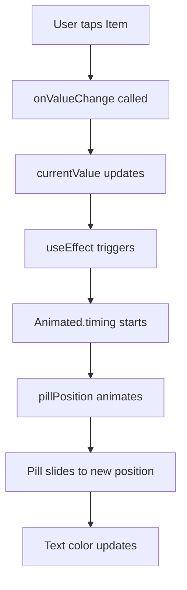

# SegmentedControl Animation Plan

## Overview

This plan outlines how to add a sliding background pill animation to the [`SegmentedControl`](packages/radix-ui-themes-native/src/components/navigation/SegmentedControl.tsx) component.

## Current Implementation Analysis

The current implementation:
- Each [`SegmentedControl.Item`](packages/radix-ui-themes-native/src/components/navigation/SegmentedControl.tsx:65) has conditional styling based on `isSelected`
- Items use `flex: 1` for equal width distribution
- Selected items get background color, border, and text color changes
- No animation exists - styling is purely static

## Animation Design

### Sliding Pill Pattern

```
┌─────────────────────────────────────────┐
│ ┌─────┬─────┬─────┬─────┐              │
│ │Item │Item │Item │Item │              │
│ ├─────┼─────┼─────┼─────┤              │
│ │ ▌▌▌ │     │     │     │  ← Pill     │
│ │ ▌▌▌ │     │     │     │              │
│ └─────┴─────┴─────┴─────┘              │
└─────────────────────────────────────────┘
```

### Key Changes

1. **Root Component Changes**:
   - Import `Animated` from `react-native`
   - Add state to track item positions via `onLayout`
   - Create an animated pill View that slides horizontally
   - Use `Animated.timing` with easing function

2. **Item Component Changes**:
   - Remove individual background/border styling
   - Keep text color changes based on selection
   - Register each item's position with the Root

## Implementation Details

### Step 1: Add Animated Import and State

```typescript
import { Animated, StyleSheet, type StyleProp, ViewStyle, type LayoutChangeEvent } from 'react-native';

// In SegmentedControlRoot:
const pillPosition = useRef(new Animated.Value(0)).current;
const [itemLayouts, setItemLayouts] = useState<Record<string, { x: number; width: number }>>({});
```

### Step 2: Track Item Layouts

```typescript
const handleItemLayout = useCallback((value: string, event: LayoutChangeEvent) => {
  const { x, width } = event.nativeEvent.layout;
  setItemLayouts(prev => ({ ...prev, [value]: { x, width } }));
}, []);
```

### Step 3: Calculate and Animate Pill Position

```typescript
useEffect(() => {
  const selectedLayout = itemLayouts[currentValue];
  if (selectedLayout) {
    Animated.timing(pillPosition, {
      toValue: selectedLayout.x,
      duration: 200,
      useNativeDriver: true,
    }).start();
  }
}, [currentValue, itemLayouts]);
```

### Step 4: Add Animated Pill to JSX

```typescript
<Animated.View
  style={[
    styles.pill,
    {
      transform: [{ translateX: pillPosition }],
      width: itemLayouts[currentValue]?.width || 0,
      backgroundColor: color ? solidVariantColors.backgroundColor : theme.colors.gray['1'],
      borderRadius: selectedRadius === 'full' ? 9999 : radii - 2,
    },
  ]}
/>
```

### Step 5: Remove Item Background Styling

Update [`SegmentedControlItem`](packages/radix-ui-themes-native/src/components/navigation/SegmentedControl.tsx:65) to:
- Remove `backgroundColor` conditional
- Remove `borderWidth` and `borderColor`
- Keep `opacity` for disabled state
- Keep text color changes

### Step 6: Pass Layout Handler to Items

Add to context:
```typescript
onItemLayout?: (value: string, event: LayoutChangeEvent) => void;
```

## Animation Configuration

| Property | Value | Notes |
|----------|-------|-------|
| Duration | 200-300ms | Standard for UI interactions |
| Easing | `Easing.inOut(Easing.quad)` | Smooth deceleration |
| useNativeDriver | `true` | Better performance |

## Color Handling

The pill will use:
- **With `color` prop**: `solidVariantColors.backgroundColor`
- **Without `color` prop**: `theme.colors.gray['1']` (matching current selected item)

## Accessibility Considerations

- Keep `accessibilityRole="radio"` on items
- Keep `accessibilityState={{ checked: isSelected, disabled: isDisabled }}`
- Pill is purely decorative, not interactive

## Testing Checklist

- [ ] Animation works on initial render with default value
- [ ] Pill slides left/right when changing selection
- [ ] All 4 sizes (1-4) work correctly
- [ ] With and without `color` prop
- [ ] Disabled items prevent animation
- [ ] Works with variable item counts (2, 3, 4+ items)
- [ ] Controlled and uncontrolled modes work
- [ ] Accessibility VoiceOver/TalkBack still announce correctly

## File Changes

**Modified**: [`packages/radix-ui-themes-native/src/components/navigation/SegmentedControl.tsx`](packages/radix-ui-themes-native/src/components/navigation/SegmentedControl.tsx)

**No new files needed**

## Mermaid: Component Flow



## Related Files

- Demo page: [`apps/playground-native/app/demo/segmented_control/index.tsx`](apps/playground-native/app/demo/segmented_control/index.tsx)
