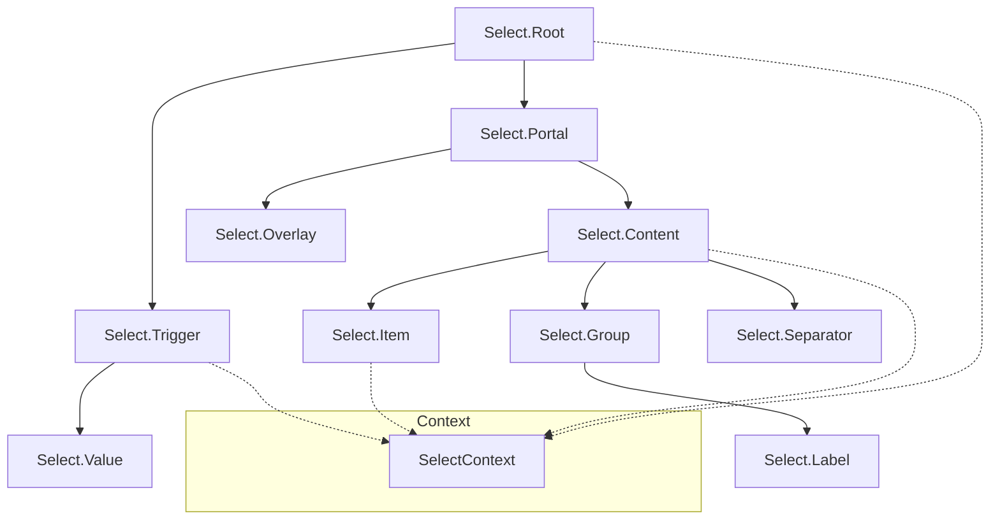

# Select Compound Component Migration Plan

## Overview

This plan outlines the migration of the `Select` component from a single-component API to a Compound Component API, **following the EXACT same structure as `DropdownMenu.tsx`**. The new implementation will display the select content inline (at the trigger position) rather than as a bottom sheet modal.

## Current Implementation Analysis

### Current API (Single Component)
```tsx
<Select
  value={value}
  onValueChange={setValue}
  items={[
    { value: '1', label: 'Option 1' },
    { value: '2', label: 'Option 2', disabled: true },
  ]}
  placeholder="Select an option"
  disabled={false}
  size="2"
  label="Label"
/>
```

### Issues with Current Implementation
1. **Not composable** - Cannot customize trigger or item rendering
2. **Bottom Sheet Modal** - Displays at bottom of screen, not at trigger position
3. **Limited Flexibility** - Cannot add custom content, icons, or complex layouts
4. **Dead Code** - Unused `renderItem` and `keyExtractor` functions
5. **Hardcoded Colors** - Chevron color doesn't respect theme
6. **Inconsistent API** - Does not match DropdownMenu compound pattern

## Proposed Compound Component API (EXACT DropdownMenu Structure)

### API Structure (Matches DropdownMenu Pattern Exactly)
```tsx
<Select.Root value={value} onValueChange={setValue}>
  <Select.Trigger asChild>
    <Button variant="outline">
      <Select.Value placeholder="Select an option" />
    </Button>
  </Select.Trigger>
  <Select.Portal>
    <Select.Overlay />
    <Select.Content side="bottom" align="start" size={2}>
      <Select.Item value="1">Option 1</Select.Item>
      <Select.Item value="2" disabled>Option 2</Select.Item>
      <Select.Separator />
      <Select.Item value="3">Option 3</Select.Item>
    </Select.Content>
  </Select.Portal>
</Select.Root>
```

### With Groups and Labels (Same as DropdownMenu)
```tsx
<Select.Root value={value} onValueChange={setValue}>
  <Select.Trigger asChild>
    <Button variant="outline">
      <Select.Value placeholder="Choose a fruit" />
    </Button>
  </Select.Trigger>
  <Select.Portal>
    <Select.Overlay />
    <Select.Content>
      <Select.Group>
        <Select.Label>Fruits</Select.Label>
        <Select.Item value="apple">Apple</Select.Item>
        <Select.Item value="banana">Banana</Select.Item>
      </Select.Group>
      <Select.Separator />
      <Select.Group>
        <Select.Label>Vegetables</Select.Label>
        <Select.Item value="carrot">Carrot</Select.Item>
      </Select.Group>
    </Select.Content>
  </Select.Portal>
</Select.Root>
```

## Component Architecture (Matches DropdownMenu Exactly)



## Component Specifications (Aligned with DropdownMenu)

### 1. Select.Root (Same as DropdownMenu.Root)

**Purpose**: Provides context and manages state for the select component.

**Props**:
| Prop | Type | Default | Description |
|------|------|---------|-------------|
| `children` | `ReactNode` | - | Child components |
| `defaultValue` | `string` | - | Default value (uncontrolled mode) |
| `value` | `string` | - | Controlled selected value |
| `onValueChange` | `(value: string) => void` | - | Callback when selection changes |
| `open` | `boolean` | - | Controlled open state |
| `onOpenChange` | `(open: boolean) => void` | - | Callback when open state changes |
| `defaultOpen` | `boolean` | `false` | Initial open state (uncontrolled) |
| `disabled` | `boolean` | `false` | Disables the entire select |

**Controlled vs Uncontrolled Usage**:

```tsx
// Controlled (with state)
<Select.Root value={value} onValueChange={setValue}>
  ...
</Select.Root>

// Uncontrolled (with defaultValue)
<Select.Root defaultValue="apple" onValueChange={(v) => console.log(v)}>
  ...
</Select.Root>
```

### 2. Select.Trigger (Same as DropdownMenu.Trigger)

**Purpose**: The button that opens the select dropdown. Uses `asChild` pattern.

**Props**:
| Prop | Type | Default | Description |
|------|------|---------|-------------|
| `children` | `ReactNode` | - | Child element (Button, etc.) |
| `asChild` | `boolean` | `true` | Merge props onto child element |

**Behavior**:
- Measures its position using `useAnchorPosition` hook
- Opens dropdown on press
- Injects `ref` and `onPress` into child element when `asChild=true`

### 3. Select.Value

**Purpose**: Displays the selected value text. Used inside Trigger's child element.

**Props**:
| Prop | Type | Default | Description |
|------|------|---------|-------------|
| `placeholder` | `string` | `'Select an option'` | Placeholder text when no value |

### 4. Select.Portal (Same as DropdownMenu.Portal)

**Purpose**: Renders content in a Modal for proper z-index layering.

**Props**:
| Prop | Type | Default | Description |
|------|------|---------|-------------|
| `children` | `ReactNode` | - | Content to render |

### 5. Select.Overlay (Same as DropdownMenu.Overlay)

**Purpose**: Backdrop that closes the select when pressed.

**Props**:
| Prop | Type | Default | Description |
|------|------|---------|-------------|
| `style` | `StyleProp<ViewStyle>` | - | Custom styles |

### 6. Select.Content (Same as DropdownMenu.Content)

**Purpose**: The dropdown content container. Positioned relative to trigger.

**Props**:
| Prop | Type | Default | Description |
|------|------|---------|-------------|
| `children` | `ReactNode` | - | Content to render |
| `side` | `'top' \| 'bottom'` | `'bottom'` | Preferred side to render |
| `sideOffset` | `number` | `4` | Distance from trigger |
| `align` | `'start' \| 'center' \| 'end'` | `'start'` | Alignment relative to trigger |
| `alignOffset` | `number` | `0` | Alignment offset |
| `avoidCollisions` | `boolean` | `true` | Flip side if collision detected |
| `size` | `1 \| 2 \| 3 \| 4` | `2` | Size variant for items |
| `style` | `StyleProp<ViewStyle>` | - | Custom styles |

### 7. Select.Item (Same as DropdownMenu.Item)

**Purpose**: Individual selectable item. Children are rendered directly.

**Props**:
| Prop | Type | Default | Description |
|------|------|---------|-------------|
| `children` | `ReactNode` | - | Item content (text, icons, etc.) |
| `value` | `string` | - | Item value (required) |
| `disabled` | `boolean` | `false` | Disable the item |
| `style` | `StyleProp<ViewStyle>` | - | Custom styles |

**Key Difference from DropdownMenu.Item**:
- Has `value` prop instead of `onSelect`
- Shows checkmark indicator when selected (based on `value` matching Root's `value`)

### 8. Select.Group (Same as DropdownMenu.Group)

**Purpose**: Groups related items with a label.

**Props**:
| Prop | Type | Default | Description |
|------|------|---------|-------------|
| `children` | `ReactNode` | - | Group content |

### 9. Select.Label (Same as DropdownMenu.Label)

**Purpose**: Label for a group of items.

**Props**:
| Prop | Type | Default | Description |
|------|------|---------|-------------|
| `children` | `ReactNode` | - | Label text |
| `style` | `TextStyle` | - | Custom styles |

### 10. Select.Separator (Same as DropdownMenu.Separator)

**Purpose**: Visual divider between items.

**Props**:
| Prop | Type | Default | Description |
|------|------|---------|-------------|
| `style` | `StyleProp<ViewStyle>` | - | Custom styles |

## Context Structure (Matches DropdownMenu Exactly)

```typescript
interface SelectContextValue {
  // Open state (same as DropdownMenu)
  open: boolean;
  onOpenChange: (open: boolean) => void;
  
  // Selection state (unique to Select)
  value: string;
  onValueChange: (value: string) => void;
  
  // Disabled state (same as DropdownMenu)
  disabled: boolean;
  
  // Positioning (same as DropdownMenu)
  anchorRef: React.RefObject<View | null>;
  anchorPosition: AnchorPosition;
  measureAnchor: () => void;
  
  // Theming (same as DropdownMenu)
  colors: ColorScale | BaseColorScale;
  radii: RadiusScale;
  size: SelectSize;
}
```

## Positioning Strategy (Same as DropdownMenu)

The select content will be positioned using the existing `useAnchorPosition` hook and `calculatePopoverPosition` function, exactly like DropdownMenu:

1. **Trigger Measurement**: When trigger is pressed, measure its position in window
2. **Content Measurement**: Wait for content layout to get dimensions
3. **Position Calculation**: Use `calculatePopoverPosition` with:
   - `side: 'bottom'` (default, can be 'top')
   - `align: 'start'` (default, matches trigger width)
   - Collision detection to flip if needed
4. **Rendering**: Position content absolutely in Modal overlay

## Theme Integration (Same as DropdownMenu)

Following the exact same patterns as DropdownMenu:

```typescript
const theme = useTheme();
const mode = useThemeMode();
const isDark = mode === 'dark';
const colors = isDark ? theme.colors.gray.dark : theme.colors.gray;
const accentColor = theme.accentColor;
```

### Size Values (Matches DropdownMenu Sizes)

| Size | Font Size | Item Padding | Min Width | Max Width |
|------|-----------|--------------|-----------|-----------|
| `1` | `fontSizes[2]` | `space[2]` / `space[1]` | 140px | 220px |
| `2` | `fontSizes[3]` | `space[3]` / `space[2]` | 180px | 280px |
| `3` | `fontSizes[4]` | `space[4]` / `space[3]` | 240px | 360px |
| `4` | `fontSizes[5]` | `space[5]` / `space[4]` | 240px | 360px |

## Accessibility

- **Trigger**: `accessibilityRole="combobox"`, `accessibilityState={{ expanded, disabled }}`
- **Content**: `accessibilityRole="listbox"`
- **Item**: `accessibilityRole="option"`, `accessibilityState={{ selected, disabled }}`
- Proper focus management and screen reader announcements

## Implementation Steps

### Phase 1: Core Structure (Follow DropdownMenu Pattern)
1. Create `SelectContext` with state management (same structure as DropdownMenuContext)
2. Implement `SelectRoot` component (same pattern as DropdownMenuRoot)
3. Implement `SelectTrigger` with `asChild` pattern (same as DropdownMenuTrigger)
4. Implement `SelectPortal` with Modal (same as DropdownMenuPortal)
5. Implement `SelectOverlay` (same as DropdownMenuOverlay)

### Phase 2: Content Components
6. Implement `SelectContent` with positioning logic (same as DropdownMenuContent)
7. Implement `SelectItem` with selection logic (similar to DropdownMenuItem but with value/selection)
8. Implement `SelectValue` for displaying selected value

### Phase 3: Optional Components (Same as DropdownMenu)
9. Implement `SelectGroup` (same as DropdownMenuGroup)
10. Implement `SelectLabel` (same as DropdownMenuLabel)
11. Implement `SelectSeparator` (same as DropdownMenuSeparator)

### Phase 4: Polish
12. Add proper TypeScript types and exports
13. Update forms index to export new Select
14. Create demo page for testing
15. Add documentation

## File Structure

```
packages/radix-ui-themes-native/src/components/forms/Select.tsx
├── SelectContext (context + hook)
├── SelectRoot
├── SelectTrigger
├── SelectValue
├── SelectPortal
├── SelectOverlay
├── SelectContent
├── SelectItem
├── SelectGroup
├── SelectLabel
├── SelectSeparator
└── Select (compound export)
```

## Export Structure (Matches DropdownMenu Exactly)

```typescript
export const Select = {
  Root: SelectRoot,
  Trigger: SelectTrigger,
  Portal: SelectPortal,
  Overlay: SelectOverlay,
  Content: SelectContent,
  Item: SelectItem,
  Group: SelectGroup,
  Label: SelectLabel,
  Separator: SelectSeparator,
  Value: SelectValue,
};

export type {
  SelectRootProps,
  SelectTriggerProps,
  SelectPortalProps,
  SelectOverlayProps,
  SelectContentProps,
  SelectItemProps,
  SelectGroupProps,
  SelectLabelProps,
  SelectSeparatorProps,
  SelectValueProps,
};
```

## Migration Guide

For users migrating from the old API:

### Before (Old API)
```tsx
<Select
  value={value}
  onValueChange={setValue}
  items={[
    { value: '1', label: 'Option 1' },
    { value: '2', label: 'Option 2' },
  ]}
  placeholder="Choose..."
  size="2"
/>
```

### After (New API - Same Structure as DropdownMenu)
```tsx
<Select.Root value={value} onValueChange={setValue}>
  <Select.Trigger asChild>
    <Button variant="outline" size="2">
      <Select.Value placeholder="Choose..." />
    </Button>
  </Select.Trigger>
  <Select.Portal>
    <Select.Overlay />
    <Select.Content size={2}>
      <Select.Item value="1">Option 1</Select.Item>
      <Select.Item value="2">Option 2</Select.Item>
    </Select.Content>
  </Select.Portal>
</Select.Root>
```

## Key Differences from DropdownMenu

| Feature | DropdownMenu | Select |
|---------|--------------|--------|
| Selection | `onSelect` callback | `value` + `onValueChange` |
| Trigger Content | Custom children | `Select.Value` displays selected item |
| Item Selection | Calls `onSelect` | Updates `value` via `onValueChange` |
| Selected Indicator | None | Checkmark shown on selected item |
| Accessibility Role | `menuitem` | `option` |

## Summary

This migration plan ensures the Select component follows the **exact same compound component API structure** as DropdownMenu:

1. **Consistency** - Same component names: Root, Trigger, Portal, Overlay, Content, Item, Group, Label, Separator
2. **Composability** - Full control over trigger and item rendering via `asChild` pattern
3. **Inline Positioning** - Content appears at trigger location using same positioning hooks
4. **Theme Integration** - Proper dark mode and color scale support
5. **Accessibility** - Proper ARIA roles and states
6. **No Extra Components** - No `.ItemText`, `.ItemIndicator`, or `.Viewport` - just like DropdownMenu
