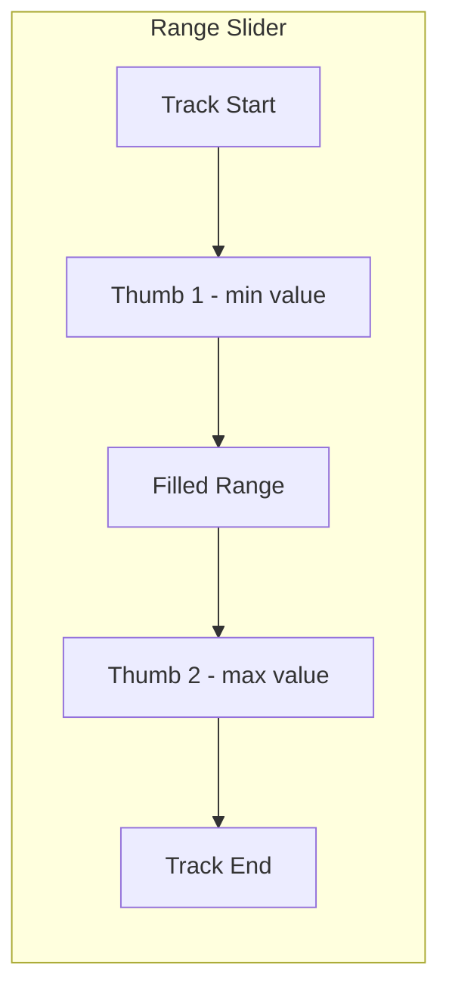
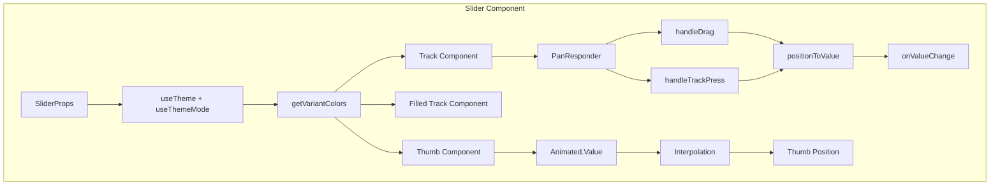

# Slider Component Improvements Plan

## Overview

This document outlines the improvements needed for the [`Slider.tsx`](packages/radix-ui-themes-native/src/components/forms/Slider.tsx) component to align with Radix UI Themes API and fix existing bugs.

---

## Current Issues

### 1. Bug: Initial thumb position incorrect (Line 123)

```typescript
const thumbPosition = useRef(new Animated.Value(value));
```

**Problem**: The thumb position should be initialized with `valueToPosition(value)` since the position is a 0-1 normalized range, not the actual value.

**Fix**: Initialize with normalized position:
```typescript
const thumbPosition = useRef(new Animated.Value(valueToPosition(value)));
```

---

### 2. Bug: Drag position calculation incorrect (Line 222)

```typescript
const position = Math.max(0, Math.min(1, gestureState.moveX / trackLayout.width));
```

**Problem**: `moveX` is an absolute screen coordinate, not relative to the track. This causes incorrect positioning when the track is not at x=0 on screen.

**Fix**: Use track layout offset:
```typescript
const relativeX = gestureState.moveX - trackLayout.x;
const position = Math.max(0, Math.min(1, relativeX / trackLayout.width));
```

---

### 3. Bug: Stale closure in PanResponder (Lines 185-206)

**Problem**: The `PanResponder` is created once in a ref and never updates. The `disabled` check inside will always use the initial value due to closure.

**Fix**: Use a ref for `disabled` or recreate PanResponder when dependencies change:
```typescript
const disabledRef = useRef(disabled);
disabledRef.current = disabled;

// In PanResponder callbacks, use disabledRef.current
```

---

### 4. Performance: Interpolations created during render (Lines 228-231, 246-249)

**Problem**: Creating new interpolations on every render can cause issues with the Animated API.

**Fix**: Memoize interpolations using `useMemo` or create them once in a ref.

---

### 5. Performance: getSizeValues called every render (Line 126)

**Problem**: `getSizeValues()` is called on every render without memoization.

**Fix**: Wrap in `useMemo`:
```typescript
const sizeValues = useMemo(() => getSizeValues(), [size, theme]);
```

---

### 6. Missing: variantColors pattern

**Problem**: The component does not use the `getVariantColors` helper like other form components ([`Button.tsx`](packages/radix-ui-themes-native/src/components/forms/Button.tsx), [`Checkbox.tsx`](packages/radix-ui-themes-native/src/components/forms/Checkbox.tsx), [`Switch.tsx`](packages/radix-ui-themes-native/src/components/forms/Switch.tsx)).

**Fix**: Add `variant` and `highContrast` props, use `getVariantColors` for consistent styling.

---

## Radix UI Themes Slider API Comparison

### Radix UI Themes (Web) Slider Structure

```tsx
<Slider.Root>           // Container with context
  <Slider.Track>        // Track background
    <Slider.Range>      // Filled portion
    <Slider.Thumb>      // Draggable thumb(s)
  </Slider.Track>
</Slider.Root>
```

### Radix UI Themes Props

| Prop | Type | Default | Description |
|------|------|---------|-------------|
| `size` | `'1' \| '2' \| '3'` | `'2'` | Size variant |
| `variant` | `'surface' \| 'classic'` | `'surface'` | Visual style variant |
| `color` | `Color` | - | Color scheme |
| `radius` | `'none' \| 'small' \| 'medium' \| 'large' \| 'full'` | `'full'` | Border radius |
| `highContrast` | `boolean` | `false` | High contrast mode |
| `defaultValue` | `number[]` | - | Initial value (uncontrolled) |
| `value` | `number[]` | - | Controlled value(s) - array for multiple thumbs |
| `onValueChange` | `(value: number[]) => void` | - | Value change callback |
| `min` | `number` | `0` | Minimum value |
| `max` | `number` | `100` | Maximum value |
| `step` | `number` | `1` | Step increment |
| `disabled` | `boolean` | `false` | Disabled state |
| `name` | `string` | - | Form field name |

### Key Differences from Current Implementation

1. **Value is an array**: Radix supports multiple thumbs via `value: number[]`
2. **Compound component structure**: Uses `Slider.Root`, `Slider.Track`, `Slider.Range`, `Slider.Thumb`
3. **Variant prop**: Supports `'surface'` and `'classic'` variants
4. **Radius prop**: Supports radius configuration
5. **High contrast mode**: Supports accessibility enhancement

---

## Proposed Improvements

### 1. Add Variant Support

Add `variant` and `highContrast` props to match other components:

```typescript
interface SliderProps {
  // ... existing props
  variant?: 'surface' | 'classic';
  highContrast?: boolean;
  radius?: RadiusSize;
}
```

### 2. Use getVariantColors for Consistent Styling

```typescript
const variantColors = useMemo(
  () => getVariantColors(theme, activeColor, mode, variant, highContrast),
  [theme, activeColor, mode, variant, highContrast]
);
```

### 3. Fix Thumb Styling Based on Variant

For `classic` variant:
- Solid colored thumb with white inner circle

For `surface` variant:
- Lighter track background
- Thumb with border and colored inner

### 4. Add Radius Support

```typescript
const radii = theme.radii[radius] ?? theme.radii.full;
const borderRadius = radius === 'full' ? 9999 : radii;
```

### 5. Support Multiple Thumbs (Range Slider)

Update value handling to support arrays:

```typescript
value?: number | number[];
onValueChange?: (value: number | number[]) => void;
defaultValue?: number | number[];
```

### 6. Add defaultValue for Uncontrolled Mode

```typescript
defaultValue?: number;
```

### 7. Add onValueChangeEnd Callback

For performance optimization in some use cases:

```typescript
onValueChangeEnd?: (value: number) => void;
```

---

## Implementation Checklist

### Phase 1: Bug Fixes
- [ ] Fix initial thumb position calculation
- [ ] Fix drag position calculation using track offset
- [ ] Fix stale closure in PanResponder
- [ ] Memoize interpolations
- [ ] Memoize getSizeValues

### Phase 2: API Alignment
- [ ] Add `variant` prop with `'surface'` and `'classic'` options
- [ ] Add `highContrast` prop
- [ ] Add `radius` prop
- [ ] Use `getVariantColors` for consistent color handling
- [ ] Add `defaultValue` for uncontrolled mode
- [ ] Add `onValueChangeEnd` callback

### Phase 3: Advanced Features
- [ ] Support multiple thumbs (range slider)
- [ ] Add compound component structure (optional)
- [ ] Improve accessibility with increment/decrement actions

---

## Range Slider (Multiple Thumbs) Implementation

### API Design

The slider should support both single value and range (two thumbs) modes:

```typescript
interface SliderProps {
  // Single value mode
  value?: number;
  onValueChange?: (value: number) => void;
  
  // Range mode (two thumbs)
  value?: [number, number];
  onValueChange?: (value: [number, number]) => void;
  
  // Or unified API matching Radix
  value?: number | number[];
  onValueChange?: (value: number | number[]) => void;
}
```

### Implementation Approach

1. **Unified Value Handling**
   - Internally always work with array: `values: number[]`
   - Single thumb: `values = [value]`
   - Range: `values = [startValue, endValue]`

2. **Thumb Management**
   - Render thumbs based on `values.length`
   - Each thumb has its own animated position
   - Track which thumb is being dragged

3. **Range Track**
   - For single thumb: filled from start to thumb
   - For range: filled between two thumbs

4. **Collision Handling**
   - Thumbs cannot cross each other
   - Minimum gap between thumbs (optional)

### Data Structure

```typescript
// Internal state
const [activeThumbIndex, setActiveThumbIndex] = useState<number | null>(null);
const thumbPositions = useRef(values.map(v => new Animated.Value(valueToPosition(v))));
```

### Gesture Handling for Multiple Thumbs

```typescript
// Determine which thumb to move based on touch position
const getNearestThumbIndex = (position: number): number => {
  const thumbPositions = values.map(v => valueToPosition(v));
  let nearestIndex = 0;
  let minDistance = Math.abs(position - thumbPositions[0]);
  
  thumbPositions.forEach((thumbPos, index) => {
    const distance = Math.abs(position - thumbPos);
    if (distance < minDistance) {
      minDistance = distance;
      nearestIndex = index;
    }
  });
  
  return nearestIndex;
};
```

### Range Slider Visual



### Props for Range Mode

| Prop | Type | Description |
|------|------|-------------|
| `value` | `[number, number]` | Array of two values for range |
| `minStepsBetweenThumbs` | `number` | Minimum steps between thumbs |
| `onValueChange` | `(value: [number, number]) => void` | Callback with both values |

---

## Color Scheme for Variants

### Classic Variant
| Element | Light Mode | Dark Mode |
|---------|------------|-----------|
| Track | `grayAlpha.6` | `grayAlpha.7` |
| Filled Track | `color.9` | `color.9` |
| Thumb Outer | `gray.1` | `gray.1` |
| Thumb Inner | `color.9` | `color.9` |

### Surface Variant
| Element | Light Mode | Dark Mode |
|---------|------------|-----------|
| Track | `colorAlpha.3` | `colorAlpha.4` |
| Filled Track | `color.9` | `color.9` |
| Thumb Outer | `gray.1` with `colorAlpha.8` border | `gray.1` with `colorAlpha.8` border |
| Thumb Inner | `color.9` | `color.9` |

### High Contrast Mode
- Use `color.12` for filled track
- Use `color.1` for text on colored backgrounds

---

## Architecture Diagram



---

## Files to Modify

1. [`packages/radix-ui-themes-native/src/components/forms/Slider.tsx`](packages/radix-ui-themes-native/src/components/forms/Slider.tsx) - Main component
2. [`packages/radix-ui-themes-native/src/components/forms/index.ts`](packages/radix-ui-themes-native/src/components/forms/index.ts) - Export updates if needed

---

## Testing Considerations

1. Test drag gesture accuracy
2. Test variant color schemes in light/dark modes
3. Test high contrast mode
4. Test radius prop
5. Test disabled state
6. Test accessibility with screen readers
7. Test step increments
8. Test min/max boundaries
