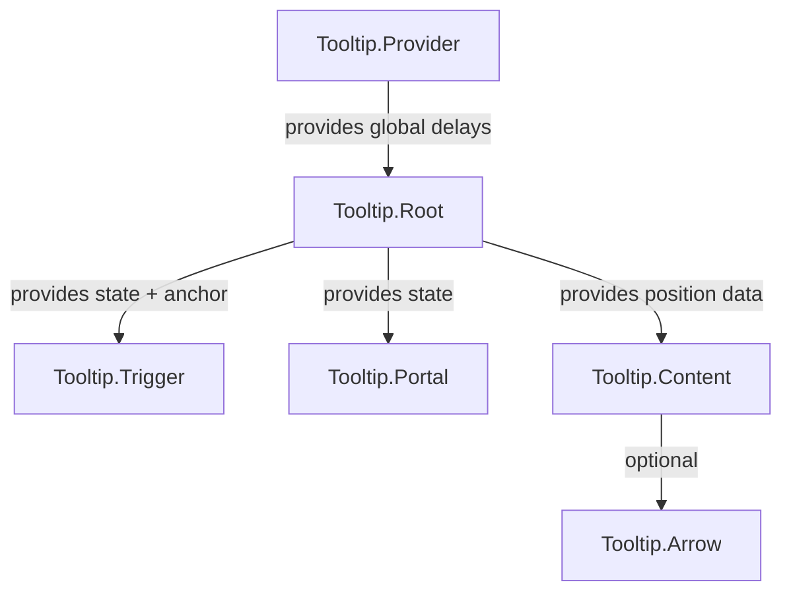

# Tooltip Component Refactoring Plan

## Overview

The current [`Tooltip.tsx`](../packages/radix-ui-themes-native/src/components/overlays/Tooltip.tsx) implementation has several architectural issues that need to be addressed. This plan outlines the refactoring approach to align it with the patterns established in [`Popover.tsx`](../packages/radix-ui-themes-native/src/components/overlays/Popover.tsx) and [`DropdownMenu.tsx`](../packages/radix-ui-themes-native/src/components/overlays/DropdownMenu.tsx).

## Current Issues

### 1. Duplicate Context Providers
- Both `TooltipProvider` and `TooltipRoot` create their own `TooltipContext.Provider`
- `TooltipProvider` has static values that don't function properly
- Creates confusion about which provider to use

### 2. Broken Positioning System
- `getPositionStyle()` uses hardcoded positions like `screenHeight - 100`
- Tooltip appears at fixed screen locations, not relative to trigger
- No measurement of trigger element position

### 3. Hardcoded Arrow Colors
- Arrow styles use hardcoded `#27272a` color
- Won't adapt to theme changes (light/dark mode)

### 4. Unused Props
- `skipDelayDuration` and `disableHoverableContent` are declared but never used
- `avoidCollisions` prop is declared but never implemented

### 5. Simple Tooltip Missing Provider
- The convenience `Tooltip` component doesn't include a Provider
- Will throw error when `useTooltip()` is called

---

## Proposed Architecture

### Component Structure

Follow the same compound component pattern as Popover/DropdownMenu:

```typescript
Tooltip.Provider  // Optional global provider for delay settings
Tooltip.Root      // State management and context
Tooltip.Trigger   // Anchor element with hover handlers
Tooltip.Portal    // Modal wrapper
Tooltip.Content   // Positioned tooltip content
Tooltip.Arrow     // Arrow indicator (optional)
```

### Context Structure



---

## Implementation Details

### Step 1: Refactor Context Structure

Remove the redundant `TooltipProvider` context creation. Keep only `TooltipRoot` as the state manager:

```typescript
interface TooltipContextValue {
  open: boolean;
  onOpenChange: (open: boolean) => void;
  colors: ColorScale | BaseColorScale;
  grayAlpha: ReturnType<typeof getGrayAlpha>;
  radii: RadiusScale;
  delayDuration: number;
  // Add anchor positioning
  anchorRef: React.RefObject<View | null>;
  anchorPosition: AnchorPosition;
  measureAnchor: () => void;
}
```

### Step 2: Integrate useAnchorPosition Hook

Import and use the existing positioning system:

```typescript
import {
  useAnchorPosition,
  calculatePopoverPosition,
  type AnchorPosition,
  type PopoverSide,
  type PopoverAlign,
} from '../../hooks/useAnchorPosition';
```

### Step 3: Update Tooltip.Trigger

- Attach `anchorRef` to the trigger element
- Call `measureAnchor()` before opening
- Keep hover-based interaction (different from Popover/DropdownMenu)

```typescript
const handlePointerEnter = () => {
  measureAnchor();  // Measure position before opening
  // ... delay logic
  onOpenChange(true);
};
```

### Step 4: Update Tooltip.Content

Replace hardcoded positioning with dynamic calculation:

```typescript
const updatePosition = useCallback(() => {
  if (contentSize.width === 0 || contentSize.height === 0) return;
  
  const calculatedPosition = calculatePopoverPosition(
    anchorPosition,
    contentSize,
    { width: screenWidth, height: screenHeight },
    side,
    align,
    sideOffset,
    alignOffset,
    avoidCollisions
  );
  
  setPosition({
    top: calculatedPosition.top,
    left: calculatedPosition.left,
  });
}, [anchorPosition, contentSize, side, align, sideOffset, alignOffset, avoidCollisions]);
```

### Step 5: Fix Arrow Colors

Make arrow colors theme-aware:

```typescript
// In TooltipContent
const arrowColor = isDark ? grayScale[9] : grayScale[12];

// In styles
arrowTop: {
  top: -6,
  borderBottomColor: arrowColor,  // Dynamic instead of hardcoded
},
```

### Step 6: Update Simple Tooltip Component

Ensure the convenience component works standalone:

```typescript
export const Tooltip = ({ children, content, ...props }) => {
  return (
    <TooltipRoot delayDuration={props.delayDuration}>
      <TooltipTrigger>{children}</TooltipTrigger>
      <TooltipPortal>
        <TooltipContent side={props.side} sideOffset={props.sideOffset}>
          {content}
        </TooltipContent>
      </TooltipPortal>
    </TooltipRoot>
  );
};
```

### Step 7: Remove or Implement Unused Props

Either implement or remove:
- `skipDelayDuration` - Implement for quick transitions between tooltips
- `disableHoverableContent` - Remove if not needed
- `avoidCollisions` - Implement using `calculatePopoverPosition`

---

## API Comparison

### Before (Current)
```typescript
// Confusing dual provider pattern
<TooltipProvider>
  <TooltipRoot>
    <TooltipTrigger>...</TooltipTrigger>
    <TooltipPortal>
      <TooltipContent>...</TooltipContent>
    </TooltipPortal>
  </TooltipRoot>
</TooltipProvider>
```

### After (Proposed)
```typescript
// Clean single root pattern (matches Popover/DropdownMenu)
<Tooltip.Root>
  <Tooltip.Trigger>...</Tooltip.Trigger>
  <Tooltip.Portal>
    <Tooltip.Content side="top" align="center">
      Tooltip text
    </Tooltip.Content>
  </Tooltip.Portal>
</Tooltip.Root>

// Or simple convenience component
<Tooltip content="Tooltip text" side="top">
  <Button>Hover me</Button>
</Tooltip>
```

---

## Files to Modify

| File | Changes |
|------|---------|
| `packages/radix-ui-themes-native/src/components/overlays/Tooltip.tsx` | Complete refactor |

## Files to Create

None - all positioning utilities already exist in `useAnchorPosition.ts`.

---

## Testing Considerations

1. **Positioning**: Verify tooltip appears correctly on all sides (top, bottom, left, right)
2. **Collision detection**: Test near screen edges
3. **Theme switching**: Verify colors adapt to light/dark mode
4. **Delay behavior**: Test hover enter/leave delays
5. **asChild behavior**: Test with custom trigger components

---

## Questions for User

1. Should we keep the `Tooltip.Provider` for global delay configuration, or remove it entirely?
2. Do you want the arrow to be rendered by default, or only when `Tooltip.Arrow` is explicitly used?
3. Should we implement `skipDelayDuration` for quick transitions between adjacent tooltips?
